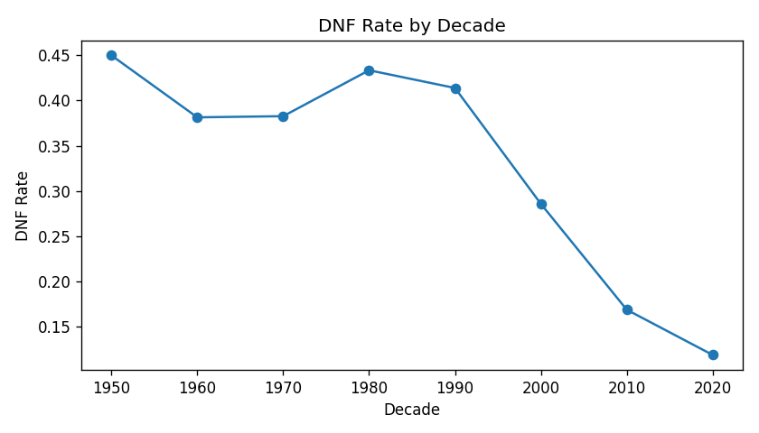
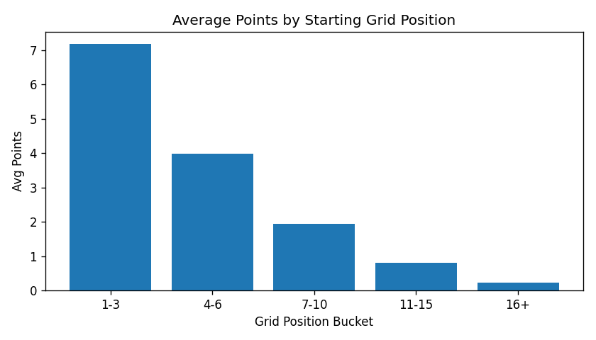
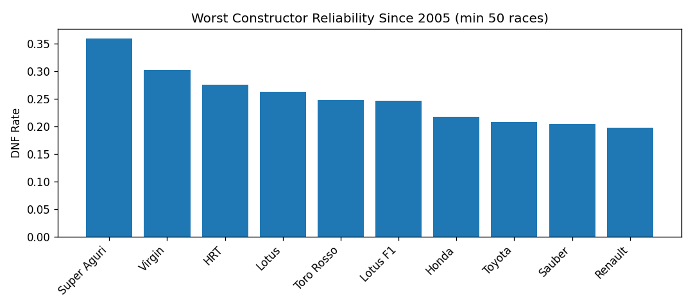

# F1 Grid Position & Reliability Analysis

Real historical Formula 1 data (1950-2024) analyzed to answer a simple question a race team would actually care about: does starting position matter more than reliability when it comes to scoring points?

## Overview

Using ~27,000 real driver-race results spanning 74 years of F1 history, this project looks at how much starting grid position affects race outcomes, how car reliability has changed over the decades, and which constructors have struggled most with DNFs (Did Not Finish).

**Data source:** Historical F1 data originally from the Ergast Developer API (now discontinued), accessed via a community GitHub mirror since the original API is no longer live.

**Tools used:**
- SQL (SQLite) - joining race results with race metadata
- Python (pandas) - cleaning, feature engineering, analysis
- Matplotlib - visualization

## Business Questions Solved

- Does starting position significantly affect a driver's ability to score points?
- How has F1 car reliability changed over the decades?
- Which constructors have the highest DNF rates?
- What are the most common reasons for race retirements?
- How much do DNFs impact overall race performance?

## Key Insights

### 1. Reliability has improved massively over F1 history



DNF rate was 45% in the 1950s and stayed above 38% through the 1990s. By the 2020s, it dropped to under 12% - a clear engineering-progress story.

### 2. Starting position strongly predicts points scored



Drivers starting in the top 3 average 7.18 points per race, while drivers starting 16th or worse average just 0.24 points.

### 3. Constructor reliability varies a lot, even in the modern era



Since 2005, Toro Rosso, Renault, and Sauber had the worst reliability among constructors with significant race volume (min 50 races), while Mercedes (9.2%) and Ferrari (11.2%) were among the most reliable major teams in that period.

**Additional findings:**
- Most retirements are mechanical failures (engine, gearbox, transmission) rather than crashes, meaning reliability is largely an engineering problem, not a driver-error problem.
- A single DNF wipes out all points for that race regardless of pace, so a small reliability gap can cost a team significant points over a season.

## Recommendations

1. **On starting position:** Teams should treat qualifying performance as a top priority, not secondary to race-day strategy.
2. **On reliability over time:** The historical drop in DNF rate shows reliability investment pays off long-term and should stay an ongoing priority.
3. **On constructors with high DNF rates:** Constructors with consistently high DNF rates should prioritize reliability upgrades over performance upgrades.
4. **On common retirement causes:** Engineering resources should focus on the specific systems that fail most (engine, gearbox, transmission) rather than broadly blaming driver error.
5. **On the impact of DNFs:** Teams should weigh reliability risk when pushing a car to its limits, since a single DNF costs all points for that race.

## Project Structure

```
f1-reliability-analysis/
│
├── data/
│   ├── race_results.csv
│   ├── races.csv
│   ├── drivers.csv
│   ├── constructors.csv
│   ├── circuits.csv
│   └── status.csv
│
├── images/
│   ├── dnf_rate_by_decade.png
│   ├── average_points_by_grid.png
│   └── constructor_dnf_rate.png
│
├── F1_Analysis.ipynb
└── README.md
```

## Process

1. **Data loading** - loaded all 6 CSV files into a SQLite database
2. **Joining** - joined race results with race metadata (season + round) to build one analysis-ready table
3. **Cleaning** - checked nulls, converted date column, confirmed how DNFs are encoded in the data
4. **Feature engineering** - created an `is_dnf` flag, grouped seasons into decades, bucketed grid positions
5. **Analysis** - calculated DNF rate by decade, average points by grid position bucket, constructor reliability since 2005 (min 50 races to avoid small-sample noise), and most common retirement causes
6. **Visualization** - charted the three findings that told the clearest story
7. **Insights & recommendations** - tied every finding directly back to one of the five business questions above

